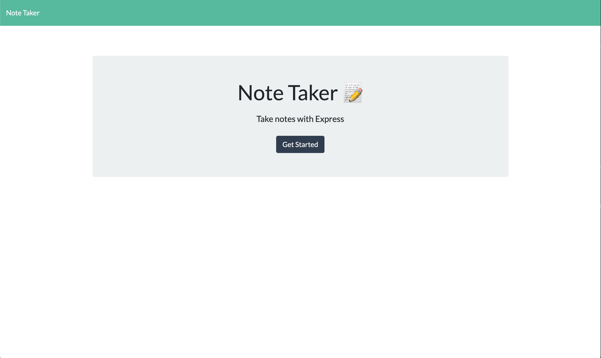
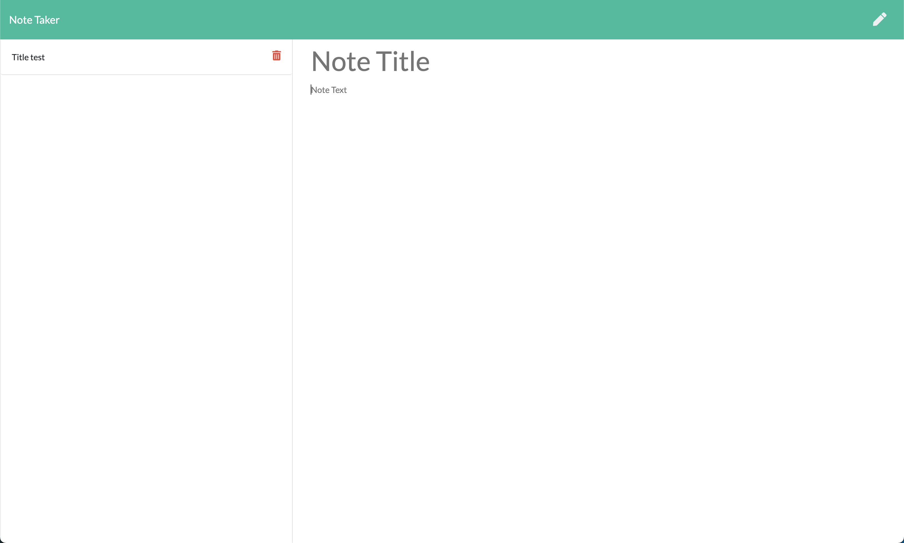

# 11 Express.js: Note Taker

## Your Task

An application called Note Taker that can be used to write and save notes. This application uses an Express.js back end and saves and retrieves note data from a JSON file.

## Deployed Site

View the deployed site [here](https://floating-cove-55482.herokuapp.com/).

Screenshot showing the deployed site's homepage:


Screenshot showing the deployed site's note page:


## User Story

```
AS A small business owner
I WANT to be able to write and save notes
SO THAT I can organize my thoughts and keep track of tasks I need to complete
```

## Technologies Used

- Node.js
- Express.js
- Heroku